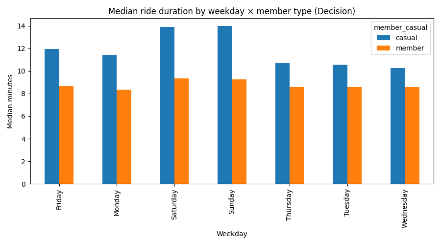
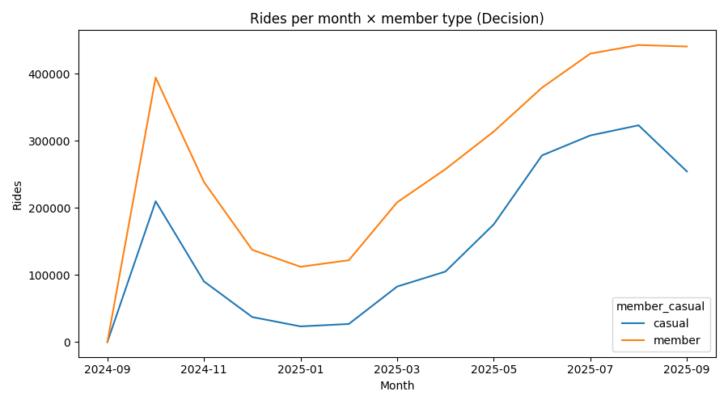
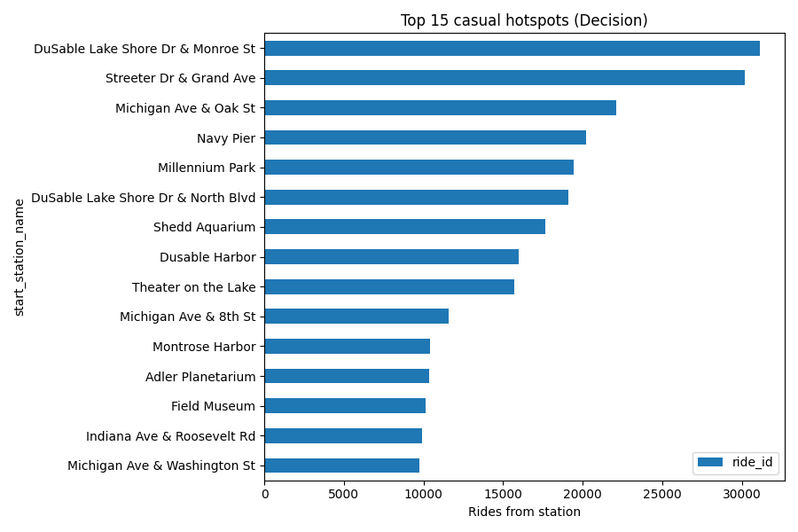
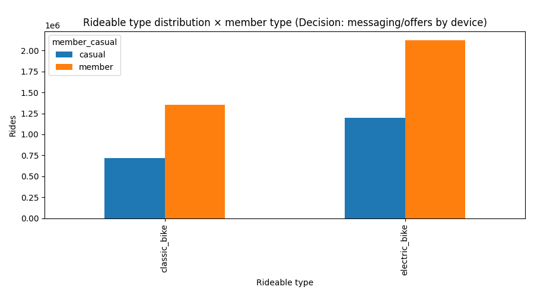
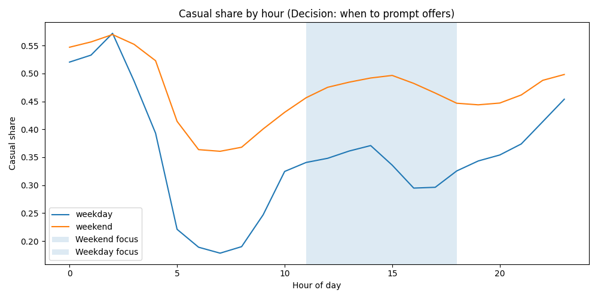

# Cyclistic Bike-Share — Portfolio Case Study

## Ask — Business Task
Convert more **casual riders → annual members** to improve predictable revenue.

## Prepare & Process — Data
12 months of Divvy ride data (public course dataset). Cleaned and engineered: `ride_length_min`, `day_of_week`, `month`, `hour`, filters for outliers.

## Analyze — Findings (with visuals)

## Share — Executive Summary (paste your auto-generated draft here)
>

## Act — Recommendations & Experiment Plan
- Weekend Day Pass → Annual Offer at top hotspots.
- Summer Weekly Pass with 14-day upgrade credit.
- On-dock prompts during weekend afternoons.
(See `docs/recommendations_and_experiment.md` for A/B design and rollout.)

## Appendix — Reproducibility
- Notebook: `notebooks/01_prepare_process_analyze.ipynb`
- Clean data: `data/processed/cyclistic_clean.parquet`
- Summary tables: `data/processed/summary_tables.xlsx`
